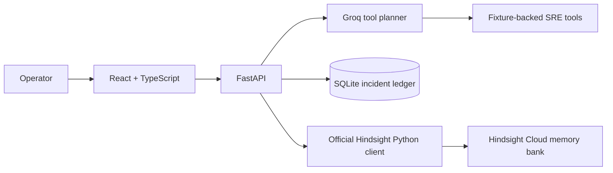

# ShadowOps

ShadowOps is an incident-response workspace for SRE teams. It investigates simulated production symptoms, inspects service signals, recalls prior incident outcomes from Hindsight, and records failed and successful remediation as persistent organizational memory.

> This project operates on deterministic simulated services. It does not connect to or modify production infrastructure.

## The Problem

During an incident, engineers often repeat investigations and remediation attempts because prior incidents are scattered across tickets, logs, and chat. Restarting a service may temporarily hide a database pool failure without fixing it. A stateless assistant cannot distinguish that temporary recovery from the later action that worked.

## The Solution

ShadowOps combines fixture-backed incident tools with a dedicated Hindsight memory bank. The agent inspects current logs, metrics, deployments, service state, and dependencies; recalls relevant historical facts; and keeps failed, partial, and successful remediation outcomes separate. Resolved incidents are retained to Hindsight, so later investigations can use their actual returned facts.

## Why Hindsight

Hindsight is the long-term memory system, not a chat log or UI decoration. ShadowOps uses its official Python client for real retain and recall operations. The app database stores operational state and receipts; it does not substitute for historical memory. Removing Hindsight recall removes the agent's cross-incident retrieval capability.

- [Hindsight GitHub](https://github.com/vectorize-io/hindsight)
- [Hindsight documentation](https://hindsight.vectorize.io/)
- [Vectorize agent memory](https://vectorize.io/what-is-agent-memory)

## Architecture



The Groq planner uses function calling when `GROQ_API_KEY` is configured. If omitted, a clearly labeled rules planner chooses tools by symptom. Hindsight and Groq keys stay on the backend.

## Memory Lifecycle

1. The operator submits incident details.
2. Groq selects bounded, validated investigation tools; the rules fallback is explicit if no Groq key is configured.
3. Tools read deterministic service fixtures and return structured evidence.
4. ShadowOps queries Hindsight with a compact symptom/evidence query. The UI only displays facts returned by that recall.
5. The operator runs one or more deterministic remediation simulations; each result is recorded as failed, partial, or successful.
6. On resolution, each attempt is retained in its own stable Hindsight document with outcome/action metadata. A separate summary document stores root cause and lesson.
7. ShadowOps records an app-side Hindsight write receipt only after all synchronous retains succeed.
8. A later investigation can retrieve those facts and adjust its recommendation.

## Features

- Five simulated services: checkout, payment, order, auth, and notifications.
- Structured service health, logs, metrics, deployments, and dependency-health tools.
- Bounded Groq function calling with schema validation, malformed-call errors, and a visible rules fallback.
- Real Hindsight Cloud recall and retain, explicit unavailable/empty states, stable document IDs, and returned metadata.
- Deterministic incident remediation simulation, including checkout 503/database pool failure and recovery.
- SQLite persistence for incidents, tool traces, remediation attempts, confirmed Hindsight receipts, and measured evaluation runs.
- Demo seed and reset/reseed endpoints. Reset only clears local app state; it does not delete the Hindsight bank. Stable demo document IDs are safely replaced on reseed.
- Side-by-side memory-disabled and Hindsight-enabled evaluation of the same incident. Latency and recalled evidence are measured per run; no improvement percentage is fabricated.
- Responsive operator UI for overview, investigation, timeline, memory evidence, service health, and evaluation.

## Requirements and Design Records

- [Hackathon requirements and traceability](docs/HACKATHON_REQUIREMENTS.md)
- [Content checklist](docs/CONTENT_REQUIREMENTS.md)
- [Hindsight design and API integration](docs/HINDSIGHT_ARCHITECTURE.md)
- [Implementation architecture and status](docs/ARCHITECTURE.md)
- [Demo runbook](docs/DEMO_RUNBOOK.md)
- [Evaluation methodology](docs/EVALUATION.md)
- [Final audit](docs/FINAL_HACKATHON_AUDIT.md)

## Technology

- Frontend: React 19, TypeScript, Vite, Lucide icons.
- Backend: Python, FastAPI, Pydantic, SQLite.
- Agent tool planner: Groq-compatible chat completions/function calling (optional rules fallback).
- Memory: official `hindsight-client` against Hindsight Cloud or a local Hindsight API server.

## Setup

Use Python 3.11+ and Node.js 20+.

```powershell
py -m venv .venv
.\.venv\Scripts\Activate.ps1
pip install -r requirements-dev.txt
npm --prefix frontend install
Copy-Item .env.example .env
```

Edit `.env` locally. Required for live memory:

```dotenv
HINDSIGHT_API_URL=https://api.hindsight.vectorize.io
HINDSIGHT_BANK_ID=shadowops-demo
HINDSIGHT_API_KEY=your-real-cloud-api-key
```

Optional tool-selection LLM:

```dotenv
GROQ_API_KEY=your-groq-api-key
GROQ_MODEL=openai/gpt-oss-120b
```

For a local Hindsight server, change the API URL to its endpoint and leave its own extraction LLM configured on that service. `.env` is ignored by Git; `.env.example` contains names/placeholders only. Never put keys in frontend variables or commit them.

## Run Locally

Terminal 1, backend:

```powershell
.\.venv\Scripts\python.exe -m uvicorn backend.shadowops.main:app --reload --host 127.0.0.1 --port 8000
```

Terminal 2, frontend:

```powershell
npm --prefix frontend run dev
```

Open `http://127.0.0.1:5173`. FastAPI OpenAPI docs are at `http://127.0.0.1:8000/docs`; backend health is at `http://127.0.0.1:8000/health`.

The SQLite ledger defaults to `data/shadowops.sqlite3`. Override with `SHADOWOPS_DB_PATH` if desired. This database is app state only; Hindsight remains the long-term memory system.

## Demo

Follow [docs/DEMO_RUNBOOK.md](docs/DEMO_RUNBOOK.md). The short story: seed real Hindsight memories, investigate checkout 503s, inspect current tool evidence and recalled outcomes, simulate a failed restart, simulate the successful pool expansion, resolve/retain, and investigate a repeat incident.

## Evaluation

The evaluation page makes two actual runs on the same input: one skips Hindsight recall; one performs real recall. Tool calls and current fixtures are retained in both arms. Measured latency, number of returned facts, and presence of explicitly tagged outcomes are saved to SQLite. See [docs/EVALUATION.md](docs/EVALUATION.md) for interpretation and limits.

## Tests

```powershell
.\.venv\Scripts\python.exe -m pytest tests -q
npm --prefix frontend run build
```

The live Hindsight Cloud lifecycle test is opt-in via `RUN_HINDSIGHT_CLOUD_E2E=1` in `.env`; it writes uniquely named test records to the configured bank. A passing unit test with an in-memory test double is not a live Hindsight verification.

## Hackathon and Content Status

The official criteria and deliverables are mapped in [docs/HACKATHON_REQUIREMENTS.md](docs/HACKATHON_REQUIREMENTS.md). The implementation audit distinguishes working software from external obligations. Articles, social posts, public Reddit submissions, a YouTube team video, screenshots/publication, and the live judge presentation still require team members to create and publish them; see [docs/CONTENT_REQUIREMENTS.md](docs/CONTENT_REQUIREMENTS.md).

## Future Improvements

- Add a production-grade LLM answer synthesis layer with strict evidence citations after the tool/memory flow.
- Add application authentication and team/tenant boundaries before any real operational data is used.
- Replace deterministic fixtures with explicitly authorized observability integrations only if this moves beyond the hackathon simulation.
- Run repeated evaluation datasets and report aggregates with uncertainty rather than inferring results from a single comparison.
