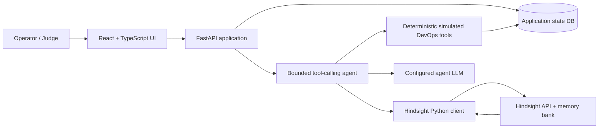

# ShadowOps Architecture and Phase 1 Plan

Status: Implementation reference. The backend memory loop, fixture-backed tool planner, SQLite ledger, demo/evaluation APIs, and React operator UI are implemented. Some original plans (20-interaction curve, a synthesis agent, external publishing, and a live judge demo) remain incomplete and are called out in [FINAL_HACKATHON_AUDIT.md](FINAL_HACKATHON_AUDIT.md).

## Product Goal

ShadowOps is an SRE incident-response agent whose future recommendations improve because it remembers prior incidents, investigation evidence, failed attempts, successful remediations, and outcomes. It operates against a deterministic simulated environment, not production infrastructure.

## System Shape



The backend owns secrets and all model/Hindsight calls. The frontend renders API results and submits user actions. The application database is for transactional state, reproducibility, and derived counts; Hindsight is the only cross-incident agent memory source.

## Proposed Repository Layout

```text
.
├── backend/
│   ├── agents/       # orchestrator, provider adapter, tool-call loop
│   ├── hindsight/    # client adapter, retain/recall, configuration checks
│   ├── incidents/    # domain models, API routes, incident lifecycle
│   ├── models/       # request/response and persistence schemas
│   ├── services/     # evaluation, metrics, demo reset/seed coordination
│   ├── tools/        # simulated logs, metrics, deployments, service/dependency health
│   └── main.py       # FastAPI application entry point
├── frontend/
│   └── src/          # React/TypeScript incident UI and memory/evaluation views
├── data/
│   ├── incidents/    # deterministic synthetic incident fixtures
│   ├── logs/         # realistic fixture log events
│   └── metrics/      # realistic fixture time series
├── docs/
│   ├── HACKATHON_REQUIREMENTS.md
│   ├── CONTENT_REQUIREMENTS.md
│   ├── HINDSIGHT_ARCHITECTURE.md
│   ├── ARCHITECTURE.md
│   ├── DEMO_RUNBOOK.md
│   ├── EVALUATION.md
│   └── FINAL_HACKATHON_AUDIT.md
├── tests/            # focused unit/integration/demo workflow tests
├── .env.example      # placeholders only; created during implementation
├── .gitignore        # secrets, caches, local DB, build output
└── README.md
```

The directory structure is intentionally proposed, not present yet. Keep UI sections cohesive and responsive: overview, active incidents, investigation, Hindsight memories, timeline, lessons, system health, and memory comparison. For an investigation, use a primary work area with current incident/evidence and a secondary historical-memory/evidence panel; small screens should stack them rather than hide memory.

## Domain Model

Use typed API/domain models (Pydantic at HTTP/tool boundaries). Persist the following app-owned records:

| Record | Important fields | Purpose |
|---|---|---|
| Incident | `incident_id`, created/updated times, service, environment, deployment version, status, summary, final root cause | Current and historical incident ledger |
| Observation | incident ID, category, timestamp, source, structured payload | Symptoms, alerts, logs, metrics, service/dependency state |
| Hypothesis | text, status, evidence references, created time | Tracks suspected causes separately from established outcomes |
| InvestigationAction | tool name, validated arguments, structured result, start/end time, error | Reproducible tool trace and latency |
| RemediationAttempt | action, start/end, outcome (`failed`/`partial`/`successful`), evidence, notes | Preserves failed vs successful approaches distinctly |
| IncidentLearning | root cause, lesson, recovery duration, recurrence, confidence, evidence references | Canonical resolved-incident narrative to retain |
| HindsightWriteReceipt | incident ID, stable document ID, bank ID, completed time, response status | App-side record of completed writes; not a substitute for recall evidence |
| EvaluationRun | scenario/input, mode, measured latency, tool trace, diagnosis fields, retrieved IDs, output | Compare same incident with memory omitted vs actual recall |

Do not use the model's free-form response as the source of truth for outcomes, metrics, or counts. Record simulation outcomes as structured state transitions.

## Tool and Agent Workflow

1. Validate a new incident request and create an incident record.
2. The agent uses a bounded tool-call loop. Tools include `get_logs`, `get_metrics`, `get_deployment_history`, `get_service_health`, `get_dependency_health`, `search_historical_incidents`, `compare_incidents`, `inspect_database_health`, and `record_incident_outcome`.
3. Every tool validates arguments and returns a typed structure. Unknown tools, malformed JSON/arguments, timeouts, and tool errors become explicit tool results; they must not crash or fabricate successful evidence. Cap tool iterations/calls to prevent runaway loops.
4. Current investigation tools query deterministic fixture-backed simulation. The model decides which tool to call; do not preload every data source as if the agent investigated it.
5. When enough current symptoms exist, call Hindsight recall through the adapter. Use retrieved records as historical evidence, not as current sensor readings.
6. Ask the configured LLM to produce summary, probable cause, evidence, recommendation, uncertainty/confidence, and references to current/historical evidence. Confidence is a model estimate unless separately calibrated and must not be presented as measured probability.
7. Simulate a selected remediation. Record the actual outcome, including temporary recovery/recurrence.
8. On resolution, produce the structured incident learning and retain it through the real Hindsight API. Save a write receipt only after a confirmed successful synchronous operation (or async completion).
9. On a future incident, retrieve the previous experience and let that evidence change the suggested next action. Display the actual recall response.

The tool schema/loop must tolerate LLM function-calling errors and invalid arguments. Provider configuration should support Groq as the recommended default but allow model/provider selection by environment configuration. Hindsight's own extraction-model settings are separate from ShadowOps's agent LLM settings.

## Simulated Environment and Data

Model five services: `checkout-service`, `payment-service`, `order-service`, `auth-service`, and `notification-service`. Seed realistic timestamps, deployment versions, request rates, p50/p95 latency, error rates/status codes, representative logs, dependencies, and remediation outcomes. Include the ten incident families in the project brief: DB connection pool exhaustion, Redis/cache failure, memory leak, API timeout, bad deployment, dependency outage, CPU spike, DB latency, auth failure, queue backlog.

The core story is a checkout 503 pattern: attempt a restart, record only temporary recovery followed by recurrence; then increase the DB connection pool and record stable recovery. Retain each action as an individual Hindsight document with outcome/action metadata plus a separate lesson summary. On the repeat incident, the agent must make an actual Hindsight recall request and display returned facts and metadata for both outcomes before recommending the durable fix. Fixtures are for the simulated environment; they must not be represented as Hindsight results until Hindsight returns them.

Demonstrate the learning curve at increasing history depths (the project brief names interactions 1, 5, 10, and 20, while allowing the exact count to change): first interaction has no relevant history and is appropriately generic; around interaction 5 the agent uses several retained patterns; around 10 it recognizes a recurring failure; around 20 it explains prior events, failed and successful attempts, and why a new incident matches an older pattern. These must be actual deterministic incident interactions retained to Hindsight and later recalled, not a UI animation or hardcoded “learned” state. Seed enough distinct, realistic outcomes to make the stages visibly different; show real recall results and explain when a stage has no applicable memory.

## State, Metrics, and Evaluation

- Planned application persistence: SQLite for local incident state and event history; no application-state storage choice replaces Hindsight.
- Derive timeline and counts from recorded incidents, remediation attempts, and successful Hindsight write receipts. Show clearly whether a value is an app-recorded count, a measured latency, a live Hindsight recall result, or an explicitly illustrative demo input.
- Evaluation runs the identical deterministic incident and fixture state in two arms. The baseline intentionally disables memory recall; the memory arm calls Hindsight. Measure response latency, count returned relevant memories, presence of cited prior failed/successful approaches, and structured diagnosis fields from each actual run. Do not claim a percentage improvement unless computed by a defined comparison over stored run data.
- Hindsight recall ranking scores are relative, not calibrated. Use rank/returned facts, not fabricated similarity percentages. Any independently computed incident-similarity score must have a defined algorithm, be validated, and be labeled separately from Hindsight.

## UI and Evidence Plan

- Overview/active incident status and calculated system health from simulation records.
- Investigation view: current symptoms, evidence, actual tool-call progress, diagnosis/recommendation, uncertainty, and outcome action.
- Hindsight panel: returned incident facts, source ID/metadata, failed and successful remediation separated, and the associated lesson. Clearly distinguish “no result” and “Hindsight unavailable.”
- Timeline and lessons view: incident → investigation → failed action → successful action → lesson → later recall, with links to app incident records and Hindsight evidence.
- Evaluation view: side-by-side actual baseline and memory runs with measured fields and configuration/error states.
- Demo reset/reseed control: explicit confirmation; affects only dedicated demo data/bank and reports reset failure rather than leaving a partially reset display.

## Security and Observability Plan

- Store secrets only in environment variables; `.env.example` contains placeholders; ignore `.env` and local database files. Backend-only LLM/Hindsight calls.
- Use synthetic data. Avoid credentials, real customer data, or production identifiers in retained content.
- Log request ID, incident ID, tool call name, Hindsight operation/status, LLM/Hindsight/total durations, and sanitized errors. Never log secrets or authorization headers.
- Validate inbound HTTP requests, LLM tool arguments, and Hindsight configuration. Bound provider/network timeouts and tool-call iterations.
- Hindsight Memory Defense may be enabled as additional defense, but it is opt-in and non-retroactive; sanitize sensitive incident content before retaining regardless.

## Implementation Phases

The first implementation milestone is the minimum complete memory loop. Secondary dashboard/evaluation work follows it.

| Phase | Scope | Exit evidence |
|---|---|---|
| 0–1 | Read requirements and approve this architecture, content map, and Hindsight design | Docs cross-check against official docs and product brief; no code yet |
| 2 | Small vertical slice: incident → agent → real Hindsight recall → recommendation → simulated resolution → real Hindsight retain | Test Incident A restart fails/pool increase succeeds; Incident B recalls A and recommends prior successful approach |
| 3 | Fixture-backed logs, metrics, deployment history, status | Structured, realistic data available via tools |
| 4 | Multi-tool investigation, bounded function calling, malformed-call handling | Tool and failure tests pass |
| 5 | Responsive React/TypeScript dashboard | Incident lifecycle operable in UI |
| 6 | Memory visualization, timeline, lessons | Counts and evidence derive from persisted/returned records |
| 7 | Controlled no-memory vs with-memory evaluation | Same scenario; actual run metrics recorded; no fabricated gains |
| 8 | Deterministic demo mode and reset/reseed | Repeatable full cycle with real Hindsight |
| 9 | Tests and bug fixing | Required error and workflow tests pass |
| 10 | README, runbook, architecture/docs, final audit | Every official requirement status backed by evidence |

## Test Plan

Tests will cover retain/retrieve adapter behavior; incident similarity decision flow; failed and successful remediation records; agent tool selection and malformed arguments; missing environment values; unavailable Hindsight and LLM; empty memory; repeated incidents; reset/reseed; and the end-to-end Incident A → Incident B learning scenario. Unit tests should mock Hindsight only to test error handling; at least one integration/demo validation must run against a real configured Hindsight instance and must not claim real recall from a mock.

## Phase 1 Requirement Check

| Product brief requirement | Design coverage |
|---|---|
| Hindsight required, meaningful, non-faked | Dedicated bank, real server-side retain/recall adapter, returned evidence displayed; explicit missing/unavailable state |
| Structured incident learning with failed/successful distinction | Typed Incident/Hypothesis/Action/Attempt/Learning records and explicit outcome fields |
| Vertical slice before broad features | Phase 2 is the first implementation milestone |
| Simulated, believable DevOps environment; no production infrastructure | Fixture-backed tools; five named services and ten requested incident families |
| Agent chooses tools and handles malformed calls | Validated schemas, bounded loop, structured errors |
| Hindsight architecture and current official API grounding | [HINDSIGHT_ARCHITECTURE.md](HINDSIGHT_ARCHITECTURE.md) cites verified official client/API pages and honest API constraints |
| UI views and before/after memory story | Investigation, memory, timeline, lessons, system health, evaluation views planned |
| Metrics calculated, not hardcoded | App DB/event records and successful write receipts; recall cards from actual Hindsight response |
| Deterministic reset and repeat demo | Stable document IDs, dedicated demo bank, tested reset/reseed flow, no fallback fake memory |
| Security, `.env`, `.gitignore`, README/docs | Included in architecture, later implementation/documentation phases |
| Required testing and observability | Test plan and sanitized request/incident/tool/provider timing logs |
| Official content/judging/submission compliance | [HACKATHON_REQUIREMENTS.md](HACKATHON_REQUIREMENTS.md) and [CONTENT_REQUIREMENTS.md](CONTENT_REQUIREMENTS.md) traceability/checklists |

## Current Implementation Status

- Implemented: FastAPI incident API; Groq function tool selection with explicit rules fallback; simulated health/log/metrics/deployment/dependency tools; checkout remediation simulation; actual Hindsight retain/recall; app-scoped per-request SDK cleanup; SQLite incident/action/attempt/receipt/evaluation persistence; ten stable demo incident records; local-state-only reset/reseed; same-input memory-disabled vs Hindsight-enabled evaluation; React dashboard/investigation/memory/timeline/system/evaluation views.
- Verified: live Cloud lifecycle test stores a historical incident, retrieves it in investigation, retains a new outcome, and retrieves the new lesson; current full suite and frontend build are recorded in the final audit.
- Not implemented: learning progression checkpoints backed by 20 distinct real interaction events, live production integrations, auth/tenant isolation, article/social/video publication, and live judge presentation. This is a deterministic simulated environment, not a production incident platform.

## Operational Decisions

Use `.env.example` only as a sanitized template. Keep real Cloud/Groq keys in root `.env`; never put them in frontend configuration. The SQLite file is application workflow state, not agent memory. `/api/demo/reset` intentionally clears only local app state, then re-retains known demo documents by stable IDs; it does not delete the Hindsight bank.
