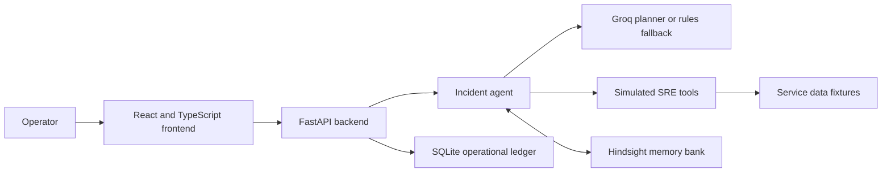

# ShadowOps: Project Explanation

## 1. What ShadowOps is

ShadowOps is a web application that helps an SRE or operations engineer investigate a service incident and learn from previous incidents. SRE means Site Reliability Engineering: the work of keeping software services available, responsive, and recoverable.

The project demonstrates a simple but important idea: when something breaks, an engineer should be able to see what the team tried before, which actions failed, which only partly helped, and which action actually fixed the problem. ShadowOps stores resolved incident knowledge in Hindsight, a persistent memory system, and retrieves relevant memories during later investigations.

The current project is a hackathon demo. Its services and telemetry are simulated with deterministic fixtures. It does **not** connect to or make changes to production infrastructure.

## 2. The problem it addresses

Incident knowledge is often spread across tickets, chat messages, dashboards, and individual engineers’ memories. During a stressful incident, responders may repeat a workaround that appeared to help once but did not fix the underlying cause. For example, restarting an overloaded service may briefly reduce errors while leaving the database connection pool too small. The errors then return.

A conventional stateless assistant sees only the current question. It cannot reliably use the organization’s prior incident experience unless that experience is deliberately saved and retrieved. ShadowOps adds that memory step to an incident-response workflow.

## 3. The main idea

ShadowOps combines three kinds of information:

1. **Current incident information** supplied by the operator, such as the service, symptoms, environment, and deployment version.
2. **Current simulated evidence** returned by tools that inspect logs, metrics, deployments, service health, and dependencies.
3. **Historical incident facts** returned by Hindsight, including previous remediation attempts and their outcomes.

The application shows these sources so the operator can compare what is happening now with what happened before. It proposes a next step, but the operator decides what to simulate and whether to resolve the incident. No production action is executed.

## 4. Example: checkout errors

Imagine the checkout service is returning HTTP 503 errors and the database connection pool is full.

1. The operator starts an investigation for the checkout incident.
2. ShadowOps gathers simulated logs, metrics, deployment information, service health, and dependency health.
3. It asks Hindsight for memories related to checkout and the observed symptoms.
4. The operator can inspect the returned evidence. It may show that restarting the service previously gave only temporary relief, while increasing the database pool resolved the problem.
5. The operator simulates a remediation and explicitly records whether the result was **Successful**, **Partial**, or **Failed**, along with an explanation.
6. When the incident is resolved, ShadowOps sends the attempted actions, outcomes, root cause, and lesson to Hindsight.
7. A later checkout investigation can retrieve those stored facts and use them as historical evidence.

This is how the demo illustrates learning over time: a later response can be informed by an earlier, completed incident.

## 5. How an investigation works

### Step 1: The operator describes the incident

The incident workspace accepts an incident ID, service, symptoms, environment, and deployment version. These fields form the incident request sent to the backend.

### Step 2: The backend chooses investigation tools

The FastAPI backend runs the incident agent. If a Groq API key is configured, the agent can use Groq function calling to choose from a bounded set of investigation tools. If Groq is not configured, a clearly identified rules-based planner selects tools from the incident symptoms.

The tools read the project’s deterministic simulated environment. Depending on the incident, they can return logs, metrics, deployment history, service readiness, or dependency status. Tool calls are validated and their results or errors are recorded in the investigation trace.

### Step 3: ShadowOps recalls historical facts

The agent builds a query from the incident’s service, symptoms, and evidence, then calls Hindsight. Hindsight performs the memory retrieval and returns ranked facts with text and metadata. ShadowOps displays facts returned by that call; it does not pretend that a local fixture or database row was recalled from Hindsight.

If there are no relevant facts, the interface reports an empty memory result. If Hindsight is unavailable or misconfigured, the backend reports that problem instead of silently claiming that memory was used.

### Step 4: The operator reviews a recommendation

The investigation result includes a summary, probable cause, recommendation, confidence, planner mode, tool trace, and historical memories. A probable cause is a hypothesis supported by evidence, not an automatic declaration that a past incident is identical to the current one.

### Step 5: The operator records remediation

Remediation simulations are deterministic examples for the demo. Before a simulated action or final resolution is submitted, the interface requires the operator to choose an outcome status and enter a written explanation. These notes help distinguish what was tried from what actually worked.

### Step 6: The completed outcome is retained

On resolution, the backend sends the incident’s remediation attempts and lesson to Hindsight. Each attempt is retained with its action and outcome metadata, and a separate summary captures the incident’s root cause and lesson. ShadowOps marks a write as confirmed only after the Hindsight operation succeeds. The application database also records a receipt for that successful write.

## 6. Why Hindsight is used

Hindsight is ShadowOps’s long-term organizational memory. It is responsible for retaining and recalling incident knowledge across separate investigations. The application database serves a different purpose: it stores the operational records needed by the UI, such as incidents, tool traces, remediation attempts, evaluation runs, and confirmed write receipts.

This separation matters:

- A SQLite incident record is not proof that Hindsight returned a fact.
- A successful Hindsight write receipt is not itself a recalled memory.
- A recalled fact is evidence from a previous incident, not proof that the current incident has the same cause.
- Hindsight’s API URL, bank ID, and API key are configured on the backend, not exposed to the browser.

The core product behavior depends on real Hindsight retain and recall calls. Replacing them with a local list would remove the cross-incident memory behavior that the project is demonstrating.

## 7. The application’s architecture

### Frontend

The frontend is built with React, TypeScript, and Vite. It collects incident inputs, calls the backend API, and presents investigation evidence, memory, system health, and evaluation results. It does not hold Hindsight or Groq credentials.

### Backend

The backend uses Python, FastAPI, and Pydantic. It validates API requests, runs the agent workflow, communicates with Hindsight, and records application state in SQLite.

### Simulated environment

Fixtures model five services: checkout, payment, order, authentication, and notifications. Their logs, metrics, deployments, health, dependencies, and deterministic remediation responses make the demo repeatable.

### Hindsight

The backend uses the official Hindsight Python client for memory writes and reads. The configured Hindsight bank is shared across the demo’s incidents so that information from one resolution can be available to a later investigation.

### SQLite

SQLite is the local operational ledger. It supports incident lists, dashboards, timelines, tool traces, remediation history, Hindsight write receipts, and evaluation history. It is not used as a replacement for Hindsight’s semantic memory retrieval.

## 8. What each page is for

- **Overview:** Summarizes incident outcomes, confirmed memory writes, the active queue, service health, and recent lessons.
- **Incidents:** Collects incident details, runs an investigation, shows tool results and Hindsight evidence, and guides remediation and resolution.
- **Timeline:** Shows recorded remediation actions and their outcomes over time.
- **Memory:** Shows facts actually returned by the latest Hindsight recall, saved lesson records, outcome details, and write-confirmation badges.
- **System health:** Displays simulated service readiness and health information.
- **Evaluation:** Runs the same incident through two investigation modes: one without Hindsight recall and one with Hindsight recall.

Outcome totals count distinct incidents with at least one remediation attempt of each outcome. A single incident can therefore contribute to more than one total; for example, the same incident may contain an early failed attempt and a later successful attempt. The Overview and Memory pages use the same counts.

## 9. The evaluation view

The evaluation page compares two actual runs against the same incident input:

- **Without memory:** The investigation uses current simulated tools but skips Hindsight recall.
- **With memory:** The investigation uses the same current tools and also recalls Hindsight facts.

ShadowOps records the measured latency, number of returned memories, whether tagged failed or successful approaches were recalled, and the resulting diagnosis and recommendation. These are measurements for the runs performed. A single pair of runs is illustrative; it is not a statistically reliable benchmark and does not establish a general performance improvement.

## 10. Demo data and reset behavior

The project includes ten stable demo incident histories. Seeding writes them to the configured Hindsight bank and stores their local incident records. Stable document IDs allow safe reseeding without creating duplicate demo documents. Reset clears the application’s local records and then seeds the demo data again; it does not delete the Hindsight bank or unrelated memories.

The demo is intentionally deterministic so that presenters can repeat the same workflow. Deterministic does not mean production data: all simulated service observations are fixtures.

## 11. Technologies

- **Frontend:** React 19, TypeScript, Vite, and Lucide icons.
- **API:** Python, FastAPI, and Pydantic.
- **Operational storage:** SQLite.
- **Agent tool planning:** Groq-compatible function calling when configured, with an explicit rules fallback.
- **Long-term memory:** Hindsight Cloud or a compatible local Hindsight API server through the official Python client.

## 12. What ShadowOps is not

ShadowOps is not a production incident-management platform, an observability integration, or an automated remediation system. It does not connect to Kubernetes, cloud accounts, production databases, or real monitoring services. Its agent does not autonomously change infrastructure. The project demonstrates the workflow and memory architecture using synthetic services and operator-confirmed simulated outcomes.

Before using this approach with real operational data, the application would need security controls such as authentication, team and tenant boundaries, secret and personal-data handling, and explicitly authorized integrations with real observability systems.

## 13. In one sentence

**ShadowOps is a simulated SRE incident-response workspace that investigates current service signals, recalls real historical lessons from Hindsight, and records operator-confirmed remediation outcomes so future investigations can benefit from what the team learned.**
